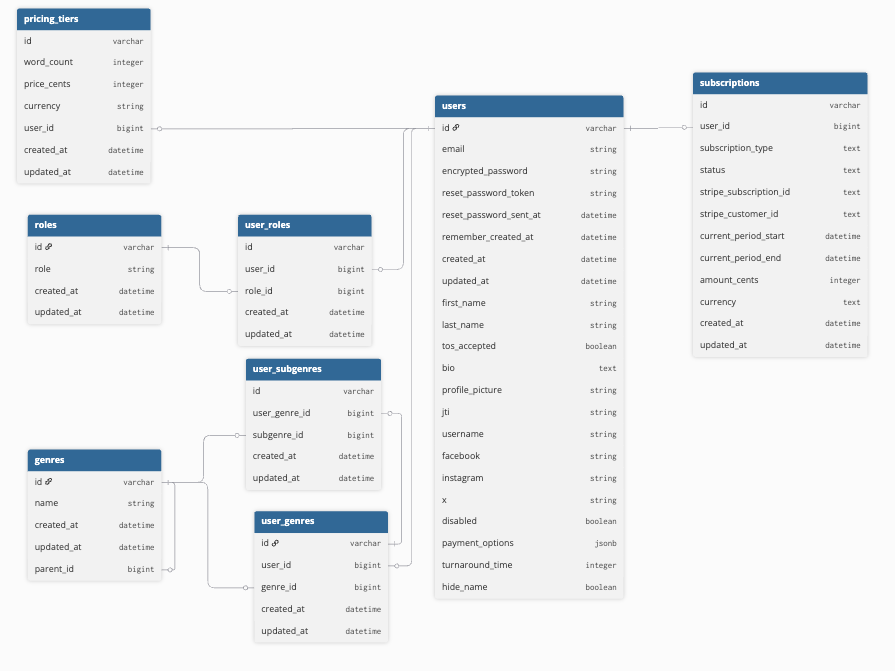

# EARLY DRAFT SOCIETY

This is a website designed for Arc, Beta, and Proof readers to be able to advertise their services and for Authors to be able to browse the list of Arc/Beta/Proof readers to find someone to work with them on their books.


## Deployed Site
[Early Draft Society](https://earlydraftsociety.com)

## Front End Repo
[Front End Repo](https://github.com/MiTOBrien/eds)

## Technology Used
* Ruby 3.2.3
* Rails 7.1.5
* PostgresSQL 1.1

### Gems
* devise
* devise-jwt
* jsonapi serializer
* RSpec 7.0.0
* shoulda-matchers
* Faker
* Factorybot
* simplecov
* Pry

### CDN
* CloudFlare R2

### Mailer
* MainGun

## Getting Started
To run this locally clone this repository onto your local machine. Change directory into the eds-be directory and install all dependiences:
```
bundle install
```

To launch the backend server:
```sh
rails server (or rails s)
```

To see the application fully functioning you will also need to clone down the front end repository and run that as well.

## Database creation and setup
To quickly set up the database from the command line:
```sh
rails db:{drop,create,migrate,seed} or rails db:reset
```
## Database schema


## Routes/Endpoints
### users
- Register        - /signup
- Login           - /login
- Logout          - /logout
- Update profile  - /users/#id
- Update password - /users/change-password
- Forgot password - /users/forgot-password

### arc/beta/proof readers
- Get readers     - /readers

### book genres & sub-genres
- Get genres      - /genres

### admin functions
- Add genres      - /admin/genres
- Update genres   - /admin/genres
- Disable user    - /admin/users

## Testing Suite
* RSpec

To run the RSpec tests from the command prompt run:
```sh
rspec spec
```